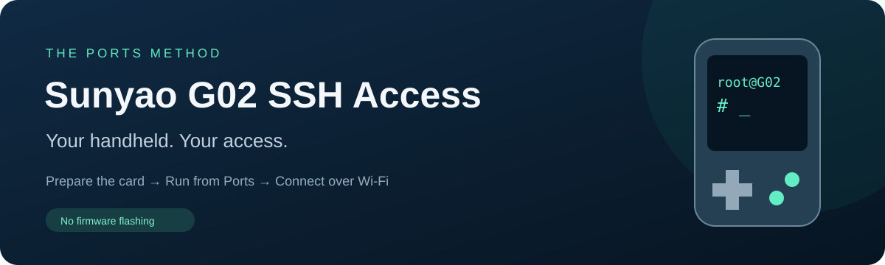

<p align="center"></p>
<p align="center">
<a href="https://github.com/jwilson529/sunyao-g02-ssh-access/releases/latest"></a>
<a href="https://github.com/jwilson529/sunyao-g02-ssh-access/actions"></a>
<a href="LICENSE"></a>
</p>

# Get back into your G02

**An “update available” message. No update menu. SSH asks for a password nobody knows.** That is where this project started.

On our Sunyao G02, games in **Ports** can run small scripts as the administrator. This package uses that existing feature to authorize **your computer's own SSH key**, giving you access over Wi-Fi. No password guessing, firmware flashing, or opening the case.

> **This unlocks SSH access. It does not install EmuELEC 4.8 or establish that 4.8 is safe for this handheld.** The factory system remains installed.

**[Download the ready-to-use ZIP](https://github.com/jwilson529/sunyao-g02-ssh-access/releases/latest)** · [Troubleshooting](docs/TROUBLESHOOTING.md) · [What changes?](docs/SECURITY.md) · [Mac / Linux](docs/MAC-LINUX.md)

## Is this for my handheld?

| Device / software | What we know |
| --- | --- |
| Sunyao G02, EmuELEC `4.7-Nexus_devel_20260526095458` | Diagnostic ran as root; key-based root SSH confirmed on real hardware. |
| Other G02 firmware versions | Not verified. Start with the diagnostic. |
| Lenovo G02, Gusgu H7, R36 Ultra | Do not assume compatibility from appearance. This release has not been tested on them. |
| ArkOS / Android | Not supported by these scripts. |

See [the testing record](docs/TESTED.md) for the distinction between the original successful method, package checks, and the guided Windows flow.

## Before you begin

You need your handheld, its game microSD card, a card reader, and a Windows PC on the same home Wi-Fi network. Allow about 10–15 minutes; this is an estimate, not a measured guarantee.

**Shut the handheld down before removing its card.** The setup copies a few small files; it does not format the card or alter your games. Once you run the enable script, this PC can administer the handheld. Keep the private key on your PC and do not expose SSH through your router.

## Windows: follow these five steps

### 1. Download and unzip

Open **[Latest release](https://github.com/jwilson529/sunyao-g02-ssh-access/releases/latest)**. Under **Assets**, download **`sunyao-g02-ssh-access-v1.0.0.zip`**.

Right-click the ZIP → **Extract All** → open the extracted folder. Do not run the tools from inside the ZIP. You should see **Setup Windows.cmd**, **Connect Windows.cmd**, and **SD Card**. For a large-print, offline walkthrough, double-click **START HERE.html**.

The scripts are plain text and unsigned. If Windows asks about an unfamiliar download, review the files and proceed only if you trust this project. No administrator window is required.

### 2. Prepare your SD card

Plug the card into your PC. Double-click **Setup Windows.cmd**.

- A list shows each drive's letter, label, and size. Choose the handheld card, **not your Windows drive**. Our card was labeled `G02ROMS`; yours may differ.
- Type its letter, for example `E`, then type **COPY** to confirm.
- If asked for a **passphrase**, press **Enter twice** for the simple setup. You may choose one instead; you will need it when connecting. The setup may ask for that passphrase once more to verify the key.
- Wait for **READY — files copied and verified**.

Your computer creates a key pair in `%USERPROFILE%\.ssh\`. Only the **public** half goes onto the card. The private half never goes onto the handheld or GitHub.

### 3. Run the tools on the handheld

Safely eject the card in Windows. Insert it into the powered-off handheld, then turn it on.

**Find `Ports` beside the console categories (NES, SNES, PlayStation, and so on). It is NOT in Settings.** Scroll through the systems, not the settings menus.

Inside **Ports**:

1. Launch **01 - Check My Handheld**.
2. Launch **02 - Enable SSH Access**.

A brief flash or return to the games screen can be normal. It is **not proof of success**: the scripts write reports to the card, and the connection in step 5 confirms the outcome.

If Ports is missing, stop here and use [the troubleshooting guide](docs/TROUBLESHOOTING.md#ports-is-missing).

### 4. Find the handheld's current IP

Connect the handheld to Wi-Fi. Look in **Network Settings** for its IP address, such as `192.168.1.50`. Leave it on and awake.

**Check the address again after every reboot.** During development, ours changed; an old address looked like an SSH failure even though access was configured correctly.

### 5. Connect from your computer

Double-click **Connect Windows.cmd**. Enter the IP currently shown on the handheld.

On the first connection, SSH asks whether to trust the device. Confirm you entered your handheld's IP and type **yes**. A passphrase prompt refers to the key you created on your PC, if you chose one.

**Success looks like a command prompt ending in `#`.** Type:

```sh
id
```

If the output includes **`uid=0(root)`**, you are connected as administrator. Type **`exit`** to disconnect. You do not need to reboot or remove the SD card after enabling access.

> Stop before installing firmware or changing system partitions. SSH access lets you inspect and back up the device; it does not make a generic update compatible.

## What is on the SD card?

```text
ports_scripts/
├── 01 - Check My Handheld.sh
├── 02 - Enable SSH Access.sh
├── 03 - Remove SSH Access.sh
└── g02-access/
    ├── common.sh
    └── workstation.pub       ← your public key, added by setup
```

The helper folder is part of the package. Copying only one `.sh` file is not enough.

## Undo access

On the handheld, launch **Ports → 03 - Remove SSH Access**. This removes the key **installed by this package**, preserving other keys and the existing password. Then disconnect any open SSH sessions and try a fresh connection; it should be rejected.

Deleting the files from the SD card alone **does not revoke access**. Removing the key does not disable the SSH server or close sessions already open. See [exact changes and recovery](docs/SECURITY.md).

## Need help?

Read [Troubleshooting](docs/TROUBLESHOOTING.md), then [open an issue](https://github.com/jwilson529/sunyao-g02-ssh-access/issues/new/choose). Include your device model, firmware version, the step that failed, and the result text. **Never post private keys or full backups.**

## Why this works / credit

The factory launcher executes Ports scripts as root on our tested G02. SSH already runs, but the stock password was not accepted. Adding a public key to root's existing `authorized_keys` provides a login without changing that password.

The [R36-ULTRA-SSH-root-password project](https://github.com/dfsx1/R36-ULTRA-SSH-root-password) documented the Ports approach on another EmuELEC handheld and inspired this investigation. This package is an independently written, key-based implementation with checks and removal support. We are not affiliated with Sunyao, Lenovo, or EmuELEC.

[MIT license](LICENSE). Contributions and carefully documented device reports are welcome.
